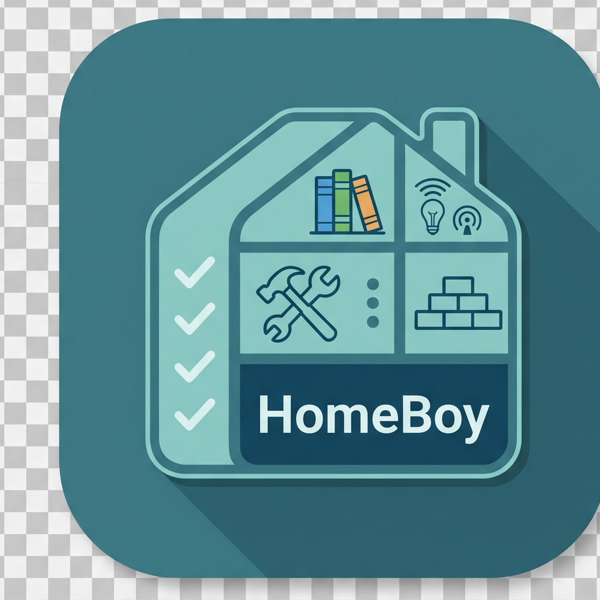

  

# HomeBoy

Rapid-input iPhone app for cataloguing items directly into a self-hosted [Homebox](https://homebox.software/) v0.25.x instance.

Target: iOS 26 · Liquid Glass UI · sideloaded via AltStore / Feather (no App Store).

## Features

- **Direct API Integration**: Connects straight to your Homebox server (v0.25.x). All items, locations, and tags are fetched and updated live via the REST API.
- **Full CRUD Support**: Create, read, update, and delete items, locations, and tags directly from the app.
- **Photo Attachments**: Capture photos using the camera or select from the photo library, automatically downscaled and uploaded.
- **Sticky Fields**: "Keep location" and "Keep tags" toggles preserve your context across submissions, making rapid cataloguing easy.
- **Smart Search**: Hybrid search with substring matching and on-device semantic search (NLEmbedding) for fuzzy matches.
- **AI Tag Suggestions**: On-device Apple Intelligence suggests relevant tags as you type item names (requires compatible device).
- **Multi-Select & Bulk Editing**: Long-press to select multiple items, then bulk-change locations, tags, or delete.
- **Sorting**: Sort items by name (A-Z / Z-A), date (newest / oldest), or quantity (high / low). Persisted across sessions.
- **Filter by Location & Tags**: Filter chips with tap-to-clear and long-press-to-change behavior.
- **Multi-Server / Multi-Group**: Switch between Homebox servers and groups (collections) seamlessly via `X-Tenant` header — no re-login needed.
- **30 Themes**: Choose from 30 color schemes ported from the Homebox web app.
- **View Modes**: Toggle between list view (with A-Z index) and card/tile grid view.
- **Barcode Scanning**: Scan barcodes to quickly populate item data.

## Screenshots

Three tabs: Items (with list/card toggle, filtering, sorting) · Locations (hierarchical tree) · Tags (color-coded).

## Build

- Every push to `main` triggers `.github/workflows/build.yml` on a macOS-15 runner.
- [XcodeGen](https://github.com/yonaskolb/XcodeGen) reads `project.yml` → generates `HomeboxCatalog.xcodeproj` (never committed).
- Unsigned IPA is uploaded to the GitHub Releases page as the `latest` pre-release.
- Sign it with AltStore on first install.

## Sideload

1. Wait for CI to finish (~5–10 min after pushing).
2. Download `HomeboxCatalog.ipa` from the [`latest` release](https://github.com/nphil/HomeBoy/releases/tag/latest).
3. AirDrop or share-sheet it to AltStore on your iPhone.
4. AltStore signs it with your Apple ID and installs it.

## Tech Stack

- **Swift 5.10** with strict concurrency
- **SwiftUI** (iOS 26 Liquid Glass)
- **XcodeGen** for project generation
- **NaturalLanguage** framework for on-device semantic search
- **FoundationModels** for AI tag suggestions (Apple Intelligence)
- No third-party dependencies

## For Developers / LLMs

See [CLAUDE.md](CLAUDE.md) for the full project reference (file map, API surface, architecture rules) and [LLM_HANDOFF.md](LLM_HANDOFF.md) for gotchas, quirks, and unwritten rules.
